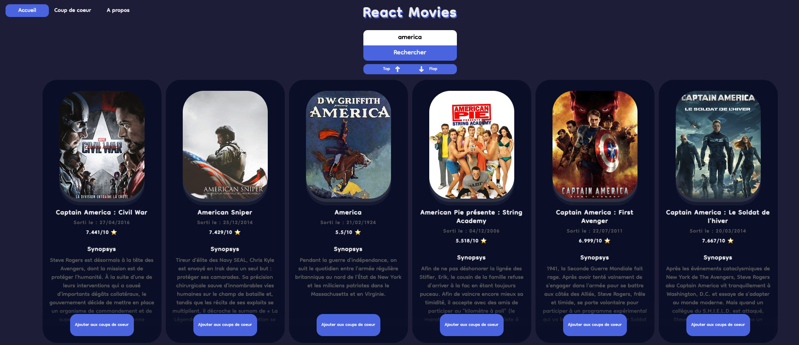

# tpdb-app

This project is a movie recommendation app that provides users with movie suggestions based on their preferences. It consists of a Spring Boot backend and a React frontend.

### Features

- Search for movied: Users can search for movies by title, genre, or other criteria.
- View movie details: Detailed information about each movie, including cast, release date, and ratings.
- Get personalized movie recommendations: The app suggests movies based on the user’s viewing history and preferences.

### Prerequisites

Before running the application, make sure you have the following installed:

- Java 11 or higher: Required for the Spring Boot backend.
- Node.js and npm: Needed for the React frontend.
- The Movie Database (TMDb) API key: Obtain your API key from TMDb to fetch movie data

### Installation

1. Clone the repository:

```sh
git clone https://github.com/rieux-renaud/tpdb-app.git
cd tpdb-app
```

2. Frontend setup

- Navigate to the frontend directory:

```sh
cd movieProjectFrontEnd
```

- Install dependencies:

```sh
npm install
```

- Start the React development server:

```sh
npm start
```

3. Access the app

- Open your web browser and visit http://localhost:3000.
- You should see the movie recommendation app running!
