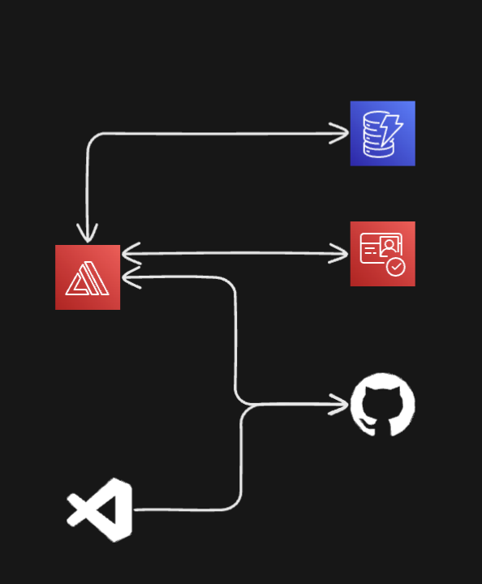

# Movie Tracker with TMDb Integration

This project, built during my CS studies, is a movie tracker app that empowers users to:

- Search and Explore Movies: Leverage The Movie Database (TMDb) to discover a vast collection of movies.
- Track Your seen movies: Mark movies you've seen, creating a personalized record of your cinematic journey.

# Stack



- Frontend: React
- Backend: Python (AWS Lambda functions)
- Authentication: AWS Cognito
- Database: AWS DynamoDB
- CI/CD: AWS Amplify

### Project Highlights:

- User-friendly interface with login/signup functionality powered by AWS Cognito.
- Integrates with The Movie Database (TMDb) API to provide detailed movie information.
- Utilizes AWS DynamoDB for storing user data (seen movies).
- Streamlined CI/CD pipeline managed by AWS Amplify.

### Dev setup

Before running the application, make sure you have the following installed:

- Node.js and npm: Needed for the React frontend.
- The Movie Database (TMDb) API key: Obtain your API key from TMDb to fetch movie data. Paste your key on a variable called "API_KEY" on a .env file.

### Installation

1. Clone the repository:

```sh
git clone https://github.com/rieux-renaud/tpdb-app.git
cd tpdb-app
```

2. Frontend setup

- Navigate to the frontend directory:

```sh
cd movieProjectFrontEnd
```

- Install dependencies:

```sh
npm install
```

- Start the React development server:

```sh
npm start
```

3. Access the app

- Open your web browser and visit http://localhost:3000.
- You should see the movie recommendation app running!
